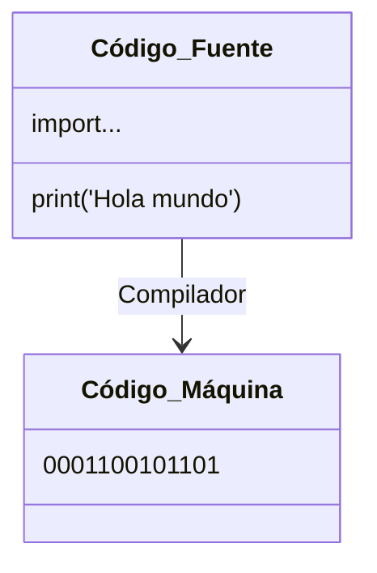
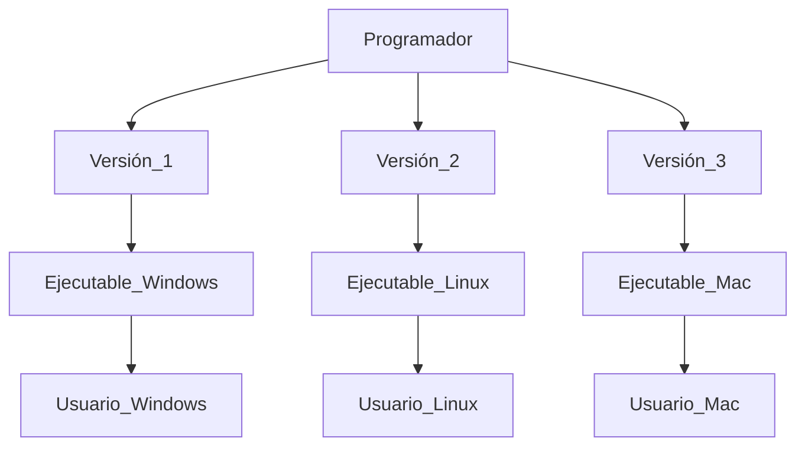
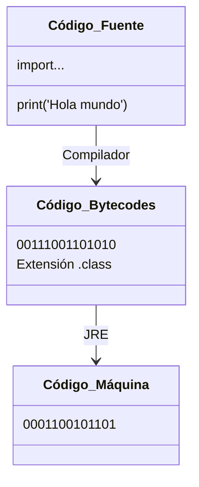
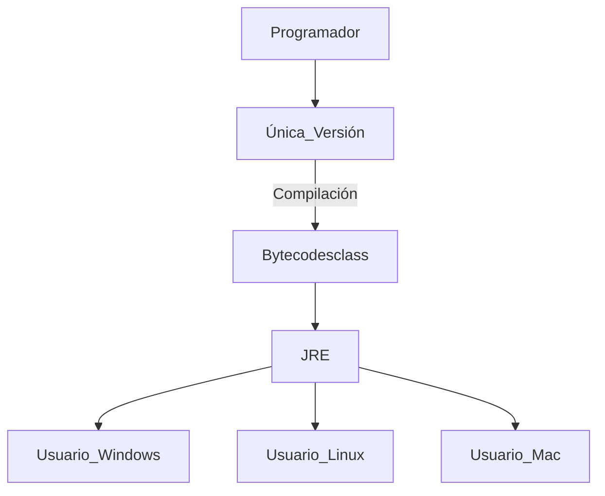

# ¿Qué es JRE?
**Java Runtime Environment** (Entorno de ejecución de JAVA)

Java es un lenguaje multiplataforma, esto implica que debe ser **Compilado** e **Interpretado**.

## ¿Qué es compilar?

Se debe generar un ejecutable distinto para cada plataforma.

Solución de Java. **Independencia de plataforma**.

Write once, run everywhere.

