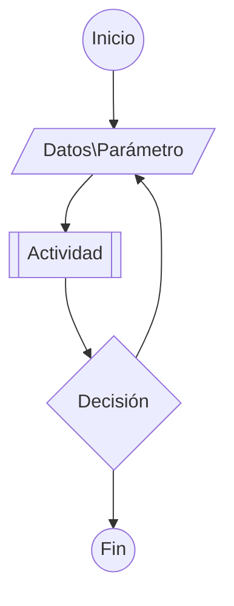

# Diagramas de Flujo


# Variables y tipos de datos

* **Integer:** Números enteros
* **Long:** Enteros de gran longitud
* **Single:** Decimales
* **Double:** Decimales de mayor precisión
* **String:** Cadena de texto
* **Boolean:** Verdadero o falso
* **Variant:** Cualquier valor
# Funciones y Subrutinas
* Procedimientos que realizan una o varias actividades
* Pueden llamar a otros procedimientos
* Pueden tener o no un parámetro
* Las funciones tienen un valor de retorno
* Las subrutinas no tienen valor de retorno
# Grabar y correr macros
En la sección de *Programador* en *Código* encontramos la opción *Grabar macro*
![[Pasted image 20240104141220.png]]
Al dar clic nos aparece la siguiente ventana donde le vamos a dar *Nombre* un *método abreviado* sobre qué libro se ejecuta y una *Descripción*
![[Pasted image 20240104141238.png]]
Al dar aceptar nos percatamos que se está grabando la macro porque se ve la siguiente opción 
![[Pasted image 20240104143029.png]]
Realizamos las tareas que queremos grabar y detenemos la grabación.
Para correr la macros que grabamos nos vamos a la opción de *Macros*
![[Pasted image 20240104143123.png]]
Vamos a ver la lista de las macros guardadas. Debemos seleccionar en qué hoja queremos ejecutar la macros.
![[Pasted image 20240104143208.png]]
# Sintaxis de funciones y subrutinas

Public/Private Function/Sub Nombre (parámetros) as Tipo de datos

* Definir si la función o subrutina será privada o pública.
* **Privado**: se refiere a que solamente se puede utilizar en ese módulo.
* **Público**: se refiere a que se puede utilizar en cualquier módulo del documento.
* Si se requiere un valor de retorno se utiliza *function*, si no se necesita valor de retorno, *sub*.
* Se puede utilizar un nombre que haga referencia al funcionamiento de la función o subrutina.
* Se incluyen las variables que representan cada uno de los parámetros necesarios.
* Se escribe el tipo de dato de el valor de retorno.

```Excel
Public Function prueba(x As Integer) As Integer

End Function
```

Para hacer un comentario agregamos una comilla '
Vamos ahora a hacer una subrutina.
```Excel
Public Sub prueba2()
	Sheets("Hoja2").Select
	Cells(1, 1) = "Hola mundo"
	Range(Cells(2, 2), Cells(3, 3)) = "Hola mundo"
	Range("A3:A5") = "Hola"
End Sub
```

* Cells
```Excel
Cells(#fila,#columna)
```
* Range
```Excel
Range(posicion1,posicion2)
```
* Sheet().Secet
```Excel
Sheets("Nombre_Hoja").Select
```
# Message Box

```Excel
Public Function div(numerador As Integer, denominador As Integer) As Double
    
    Dim a
    
    div = numerador / denominador
    
    a = MsgBox("El resultado de la división es " & div, vbOKOnly, "Division")
    
End Function

```
Al ejecutar 
```Excel
?div(8,2)
```
Nos sale la siguiente ventana
![[Pasted image 20240104175940.png]]
# Input Box

```Excel
Public Function div(denominador As Integer) As Double
    
    Dim a
    
    Dim numerador As Integer
    
    numerador = InputBox("Escribe el numerador")
    
    div = numerador / denominador
    
    a = MsgBox("El resultado de la división es " & div, vbOKOnly, "Division")

End Function
```
Al ejecutar
```Excel
?div(3)
```
Nos sale la siguiente ventana
![[Pasted image 20240104213629.png]]
escribimos 7 y nos da el resultado
![[Pasted image 20240104213702.png]]
Ahora hacemos una subrutina
```Excel
Public Sub divs()
    Dim num As Integer
    Dim den As Integer
    
    num = InputBox("Numerador", "Division")
    den = InputBox("Denominador", "Division")
    
    Dim a
    
    a = MsgBox(num / den, , "Division")
    
End Sub
```
Lo ejecutamos y nos pude ambos datos
# Select Case
```Excel
Public Function SC(a As Integer, b As Integer, c As Integer) As String
    
    Dim sum As Integer
    
    sum = a + b + c
    
    Select Case suma
    
        Case Is < 0
            SC = "Negativo"
        
        Case Is = 0
            SC = "Cero"
        
        Case Else
            SC = "Positivo"
    End Select
    
End Function
```
# If - Then
```Excel
Public Function dado() As String
    Dim VD As Integer
    VD = Int(Rnd * 6 + 1)
    Dim residuo As Integer
    
    residuo = VD Mod 2
    
    If residuo = 0 Then
        dado = VD & " Es par"
    Else
        dado = VD & " Es impar"
    End If
        
End Function
```
# Ciclos For - Next
```Excel
Public Sub Fibonacci()
    
    Dim contador As Integer
    Dim n As Integer
    
    n = InputBox("Elementos de la sucesion", "Fibonacci")
    
    Cells(1, 1) = 1
    Cells(2, 1) = 1
    For contador = 3 To n
        Cells(contador, 1) = Cells(contador - 1, 1) + Cells(contador - 2, 1)
    Next contador
    
End Sub
```
# Ciclos Do While - Loop
```Excel
Public Function DW() As Integer
    
    Dim dado As Integer
    Dim i As Integer
    Dim s As Integer
    
    dado = WorksheetFunction.RandBetween(1, 6)
    
    Do While s < 100
        i = i + 1
        s = s + dado
    Loop
    
    DW = i
End Function
```
