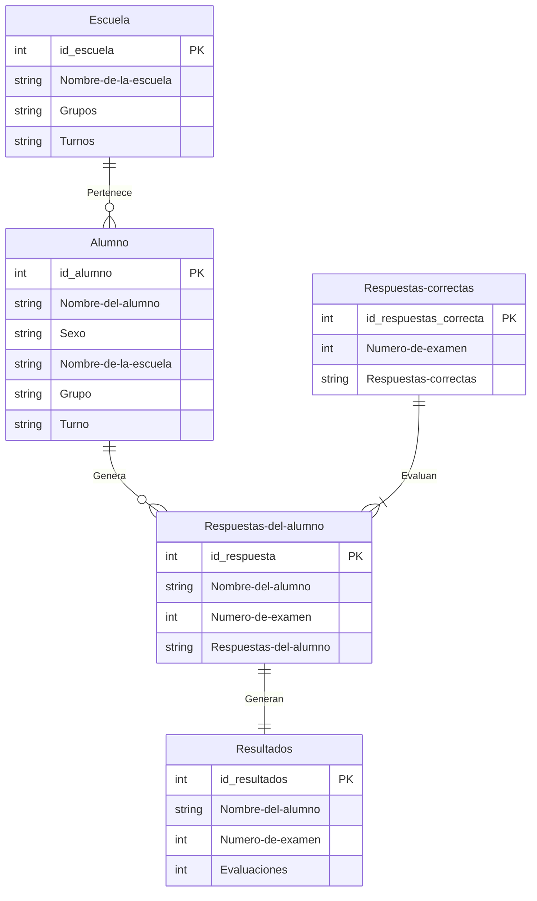

# Problema
Una empresa local que brinda servicios educativos a jóvenes de secundaria y preparatoria, 
Calificar un examen de opción múltiple para uno o dos alumnos no representa mayor esfuerzo que dedicarle algunos minutos, pero si son grupos de $30$, $60$ o incluso una escuela completa, ya se convierte en un problema y si además le sumas que quieres entregar un reporte a cada alumno sobre sus resultados, se convierte en semanas de trabajo. 
Este problema se puede resolver creando una plantilla de Excel que haga todo el trabajo de forma automática, con el único esfuerzo de capturar las respuestas y que la computadora se encargue del resto. 
## ¿Por qué Excel?
Elegimos usar Excel porque este problema le puede ocurrir a profesores de primaria, secundaria o preparatoria que no necesariamente tengan conocimientos avanzados de programación y tiempo. Todo mundo tiene Exel en sus computadoras, por eso es la opción práctica.
# Plan
Cada examen contiene la siguiente información.
* Escuela
* Nombre del alumno
* Sexo
	* Masculino o Femenino
* Turno
	* Matutino o Vespertino
* Grupo
	* $A$, $B$, $C$, $D$, $E$, etc
* Respuestas 
	* Cada pregunta contiene $4$ opciones de respuesta ($A$, $B$, $C$, $D$), puede seleccionar solo una.
## Diagrama Entidad-Relación

## Excel

